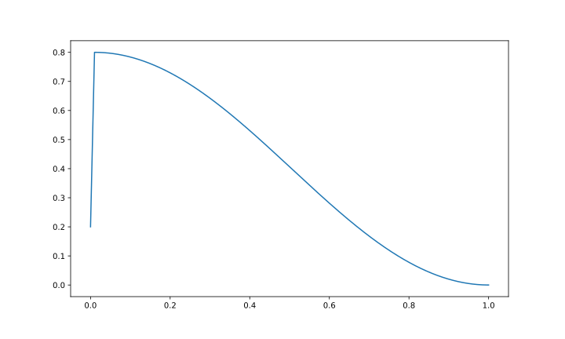

# line-chain [](https://travis-ci.com/FebruaryBreeze/line-chain) [](https://codecov.io/gh/FebruaryBreeze/line-chain) [](https://pypi.org/project/line-chain/)

Value Scheduler based on Progress.

## Installation

Need Python 3.6+.

```bash
pip install line-chain
```

## Usage

```python
import line_chain

line_chain = line_chain.factory(config=[
    {
        'mode': 'linear',
        'ratio': 0.01,
        'start': 0.2,
        'target': 0.8
    }, {
        'mode': 'cosine',
        'ratio': 1.0,
        'target': 0.0
    }
])

print(line_chain)
#> LineChain (
#>     1.0%, linear from 0.2 to 0.8,
#>   100.0%, cosine from 0.8 to 0.0,
#> )


# plot it!
import numpy as np
import pylab as pl

x = np.linspace(0, 1, 1000)
y = np.vectorize(line_chain.at)(x)
pl.plot(x, y)
```


